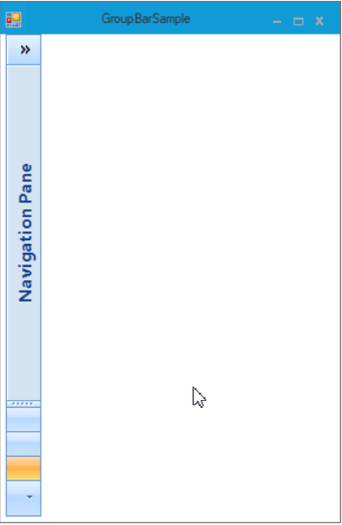

# How to Customize the Background for Collapsed GroupBar Navigation Pane in WinForms
This example demonstrates how to customize the highlight color for the collapsed navigation pane buttons in the Syncfusion WinForms GroupBar control. The GroupBar provides a navigation pane similar to Microsoft Outlook, and when collapsed, it displays a compact view with floating buttons. You can change the appearance of these buttons dynamically to match application themes or provide visual feedback on user interaction.

## Why This Is Useful
- **Theme Customization**: Match your application’s color scheme.
- **Dynamic Styling**: Change colors based on user actions or preferences.
- **Improved UX**: Provide visual feedback when interacting with collapsed navigation panes.

## Key Features Demonstrated
- Change the highlight color of collapsed navigation pane buttons at runtime.
- Handle _MouseClick_ event to apply custom styles.
- Use Syncfusion’s built-in color properties like _FloatHighlightButtonColor_.

## Example Code

```C#
public partial class Form1 : MetroForm
{
    public Form1()
    {
        InitializeComponent();
    }

    private void GroupBar1_MouseClick(object sender, MouseEventArgs e)
    {
        // Change the highlight color for collapsed navigation pane buttons
        Office2007BlueColors.Default.FloatHighlightButtonColor = Color.Pink;
    }
}
```

```VB
' When collapsed navigation pane is clicked 
Private Sub GroupBar1_MouseClick(ByVal sender As Object, ByVal e As MouseEventArgs)
Office2007BlueColors.Default.FloatHighlightButtonColor = Color.Pink
End Sub
```

## Output:



